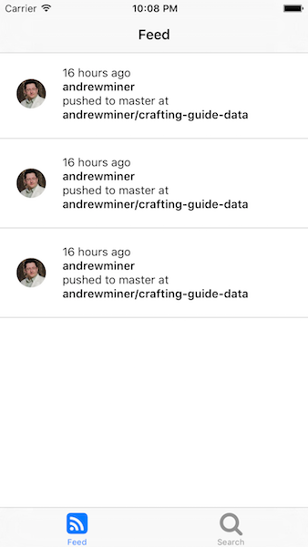
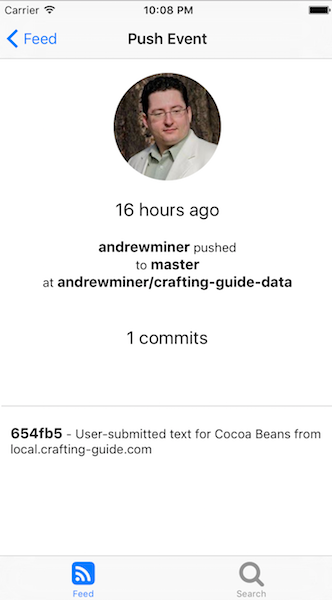

# Github Browser

My first react native app...

## Try it out

On a mac, make sure your environment is set up. First visit [react native docs](http://facebook.github.io/react-native/docs/getting-started.html#content) and follow instructions to get started.

Then clone this repo and run `react-native run-ios`

## Screenshots

If you cant try it out just look at this pictures instead :+1:

### Login screen

### Feed

### Feed item

